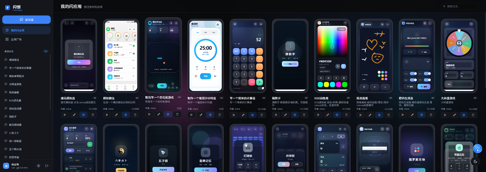
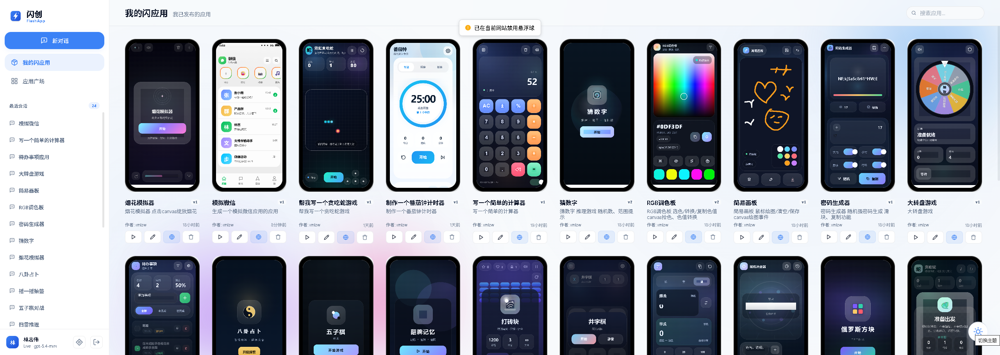
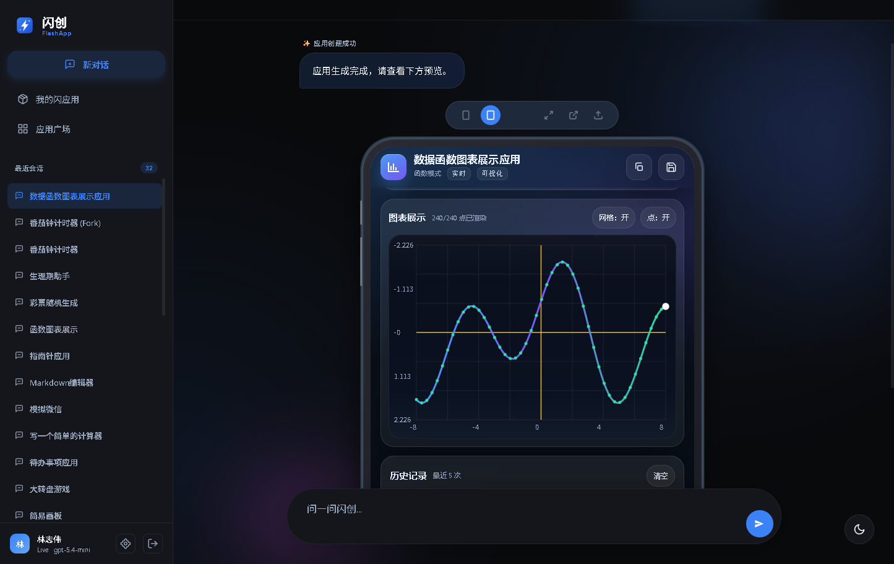
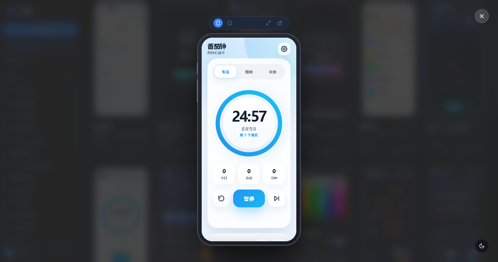
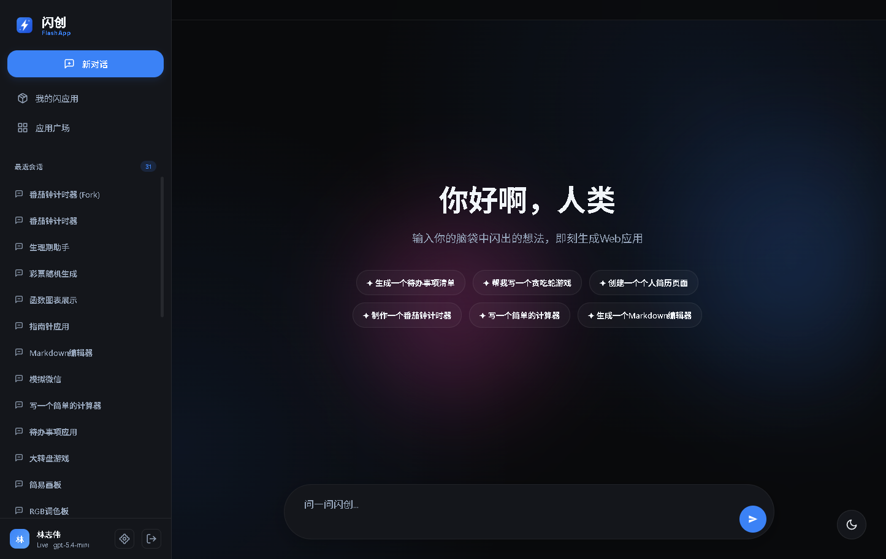
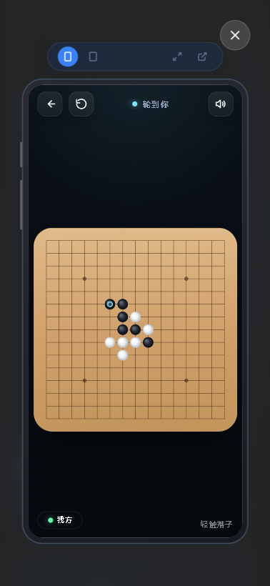

# FlashApp

FlashApp 是一个轻量级 AI H5 生成、托管与分享平台原型。



## 核心特性
- **纯净架构**: 单体 Go 后端 + 原生 HTML/JS/CSS 前端，无沉重依赖。
- **核心体验**: 流式 AI 代码生成、实时 iframe 预览、代码自动落盘部署。
- **极低消耗**: 针对 128MB 内存环境优化设计（具体见 PRD）。

## 快速启动

```powershell
go run ./src/cmd/flashapp
# 或者使用内置脚本
.\run.ps1
```

默认运行在 `http://localhost:18080`。

### 配置说明
系统支持通过 `config.json` 或环境变量进行配置。
- **OpenAI 模式 (默认)**: 支持所有兼容 OpenAI 规范的 API（如 DeepSeek, Kimi 等）。
- **Gemini 模式**: 支持 Google Gemini 原生流式接口。

#### 环境变量参考
| 变量名 | 描述 | 示例 |
| :--- | :--- | :--- |
| `FLASHAPP_LLM_PROVIDER` | 服务商 (`openai` 或 `gemini`) | `gemini` |
| `FLASHAPP_LLM_API_KEY` | API 密钥 | `sk-xxx` |
| `FLASHAPP_LLM_API_URL` | API 地址 (OpenAI 模式必填) | `https://api.openai.com/v1/chat/completions` |
| `FLASHAPP_LLM_MODEL` | 模型名称 | `gpt-4o`, `gemini-1.5-flash` |

如果没有配置有效的 API Key，系统会自动使用内置的 **Mock 模式**（模拟生成）进行完整流程演示。

## 文档索引

为了保持根目录整洁，所有详细文档已进行归类：

- **🤖 AI 智能体开发规范**: 请务必参阅 [`GEMINI.md`](GEMINI.md)。该文件包含了所有关于目录结构、代码拆分、UI 布局稳定性以及**文件安全修改**的强制性规则。
- **📄 产品需求文档 (PRD)**: 详细的产品架构和接口设计请参阅 [`docs/PRD.md`](docs/PRD.md)。

## 项目预览效果

















## 个人部署网站

部署在个人服务器上，可以玩一下：

[http://flashapp.jweb.cc](http://flashapp.jweb.cc)   
[http://flashapp.imlzw.cn](http://flashapp.imlzw.cn)
